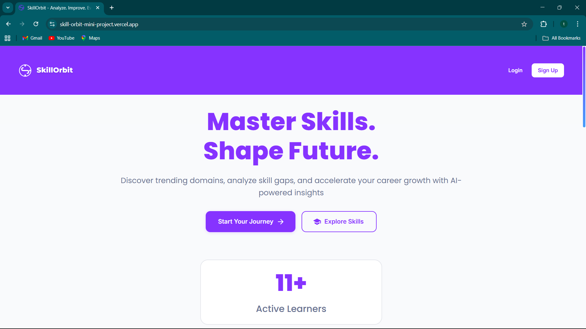
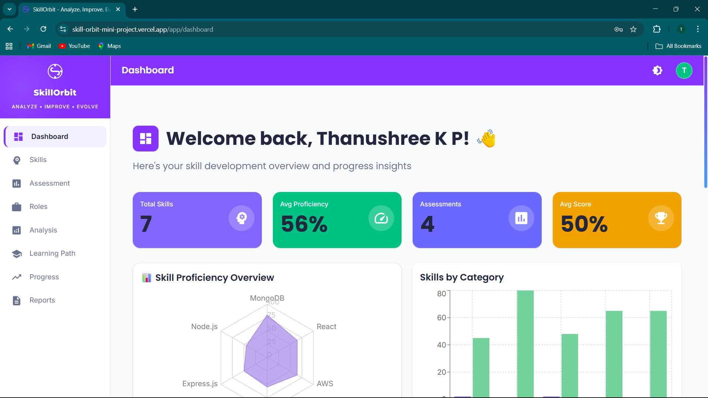
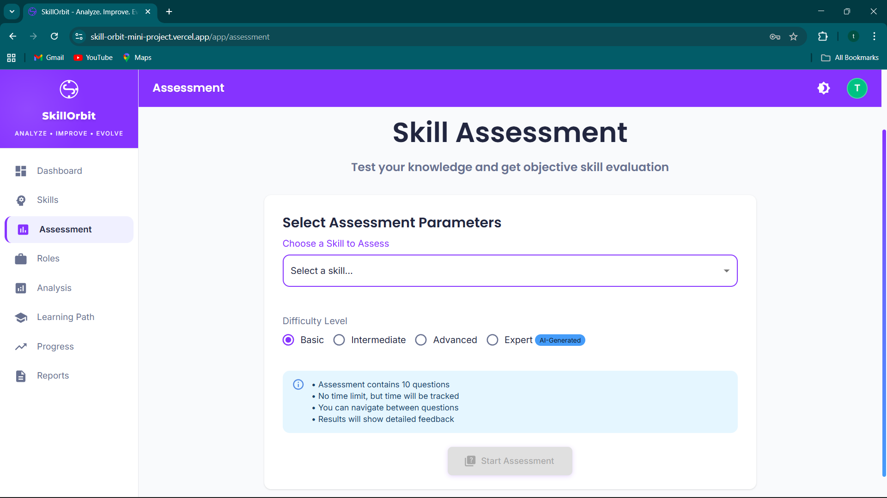
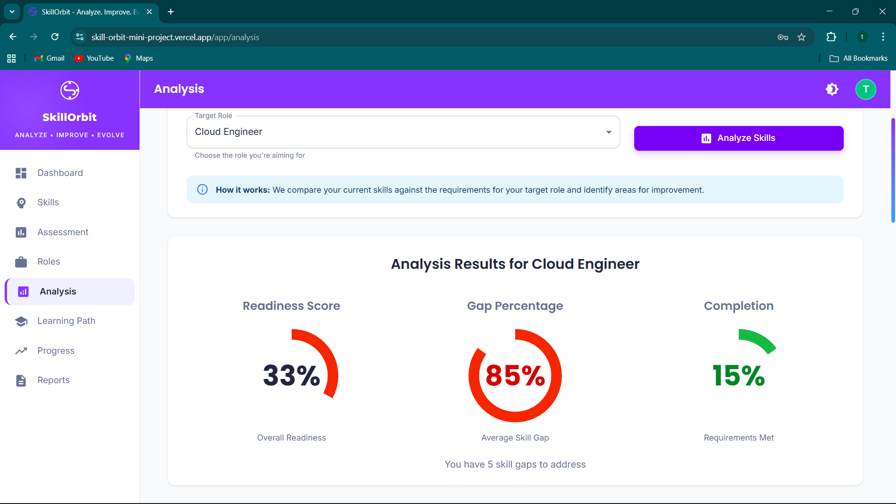
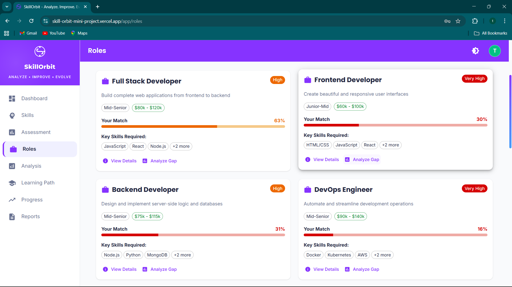

# SkillOrbit 🎯

SkillOrbit is an AI-powered skill assessment and personalized learning platform designed to help students and professionals identify skill gaps and improve their technical skills through structured assessments and AI-driven learning paths.

---

## 🚀 Key Features
- **User Authentication**: Secure registration and login with email verification via OTP
- **Skill Assessment**: 600+ curated technical questions across 10 tech domains
- **AI-Powered Learning Paths**: Personalized learning recommendations using LLaMA 3.3-70B
- **Skill Gap Analysis**: Compare your skills against target job roles
- **Progress Tracking**: Visual analytics and progress monitoring
- **Report Generation**: Comprehensive PDF reports with skill insights
- **Simplified Admin Panel**: Essential tools for managing questions, users, and viewing analytics
- **Delete Account**: Users can delete their account with feedback

---

## 🛠 Tech Stack
**Frontend:** React, Material UI, Vite  
**Backend:** Node.js, Express  
**Database:** MongoDB  
**AI:** Groq Cloud (LLaMA 3.3-70B)  
**Deployment:** Vercel, Render, MongoDB Atlas

---

## 🔗 Live Demo
👉 https://skill-orbit-mini-project.vercel.app

---

## 📸 Screenshots

### Landing Page


### Dashboard


### Skill Assessment


### Gap Analysis


### Role Matching


---

## 📂 GitHub Repository
👉 https://github.com/Thanushreekp22/SkillOrbit--MiniProject

---

## ⚙️ Setup (Quick)
```bash
git clone https://github.com/Thanushreekp22/SkillOrbit--MiniProject.git
cd SkillOrbit--MiniProject
